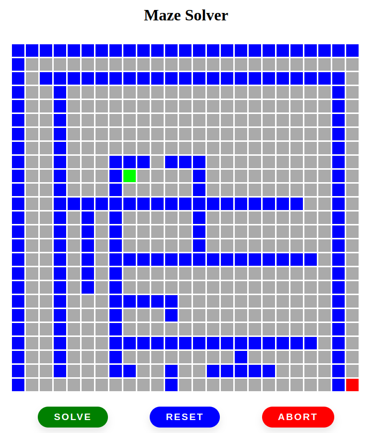
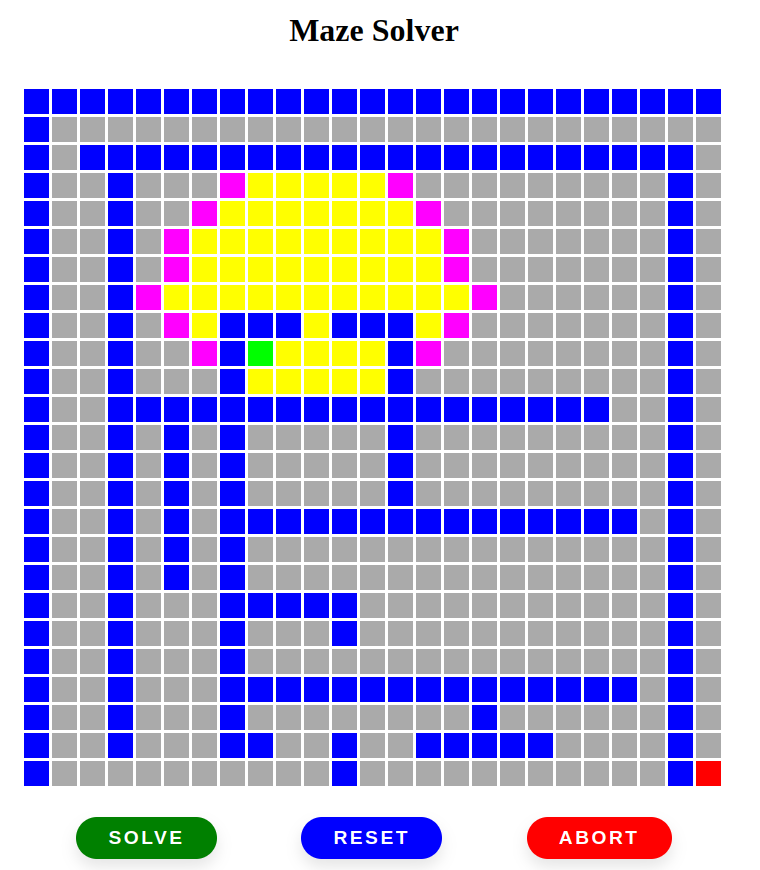
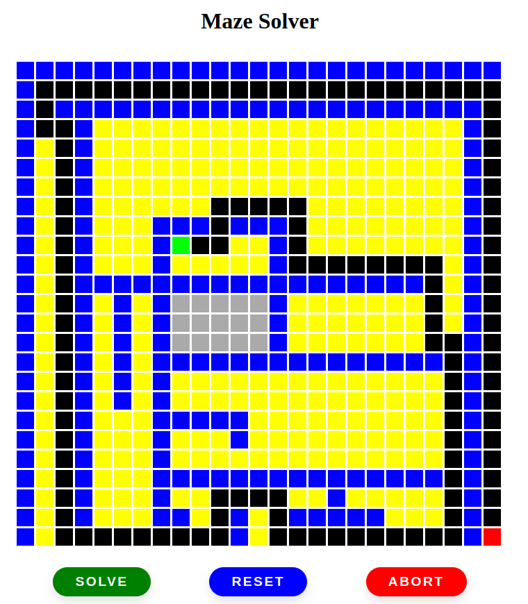

# Maze Solver

**Número da Lista**: X 
**Conteúdo da Disciplina**: Grafos 1 

## Alunos
|Matrícula | Aluno |
| -- | -- |
| 18/0062760  |  Bruno Bernardes Duarte |

## Sobre 
O projeto consiste em um resolvedor de labirinto, o qual é desenhado na tela pelo usuário.

## Screenshots

## Instalação 
**Linguagem**: Javascript 
[Disponível Aqui !](https://brunobd.github.io/Grafos1_MazeSolver/)
## Uso 
Basta desenhar o labirinto com o mouse e clicar no botão "Solve!"
## Outros 

